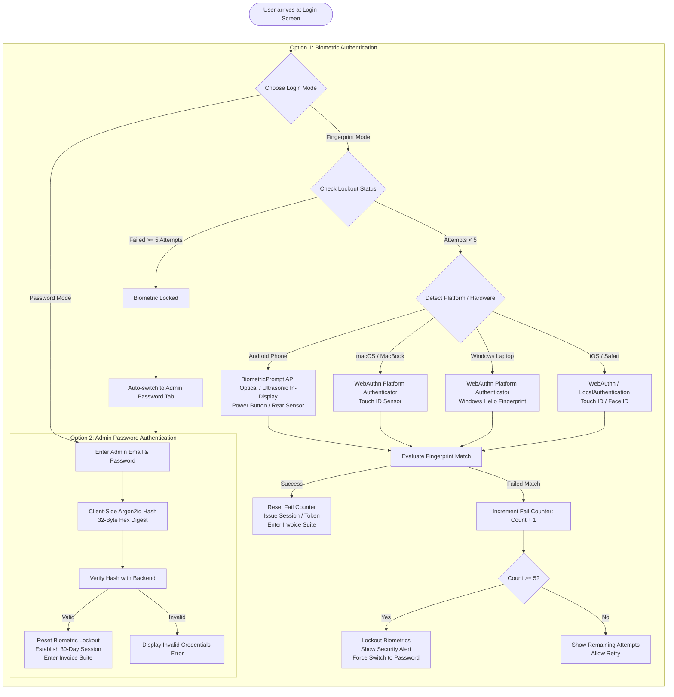
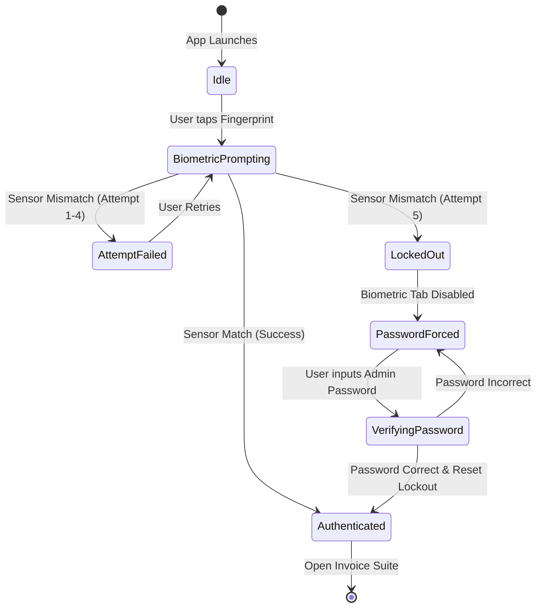
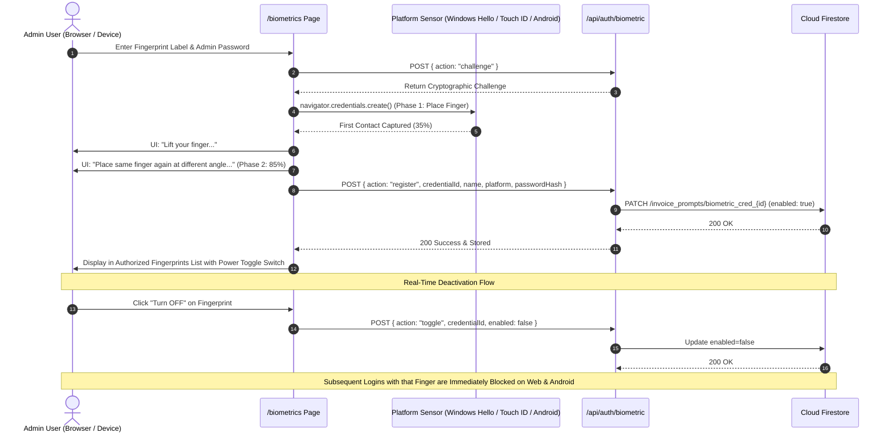
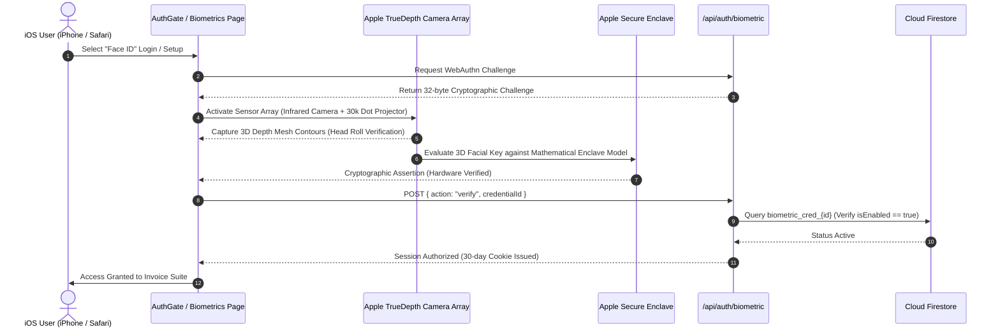
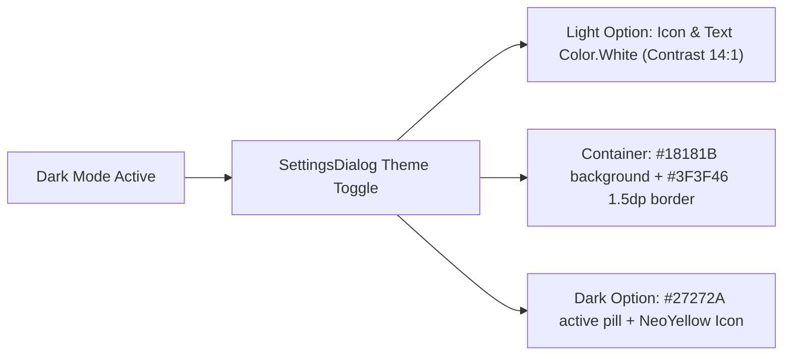
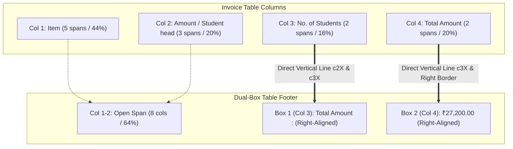
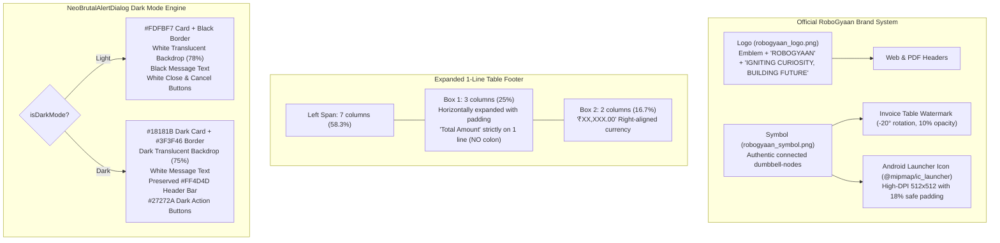

# 🏛️ RoboGyaan Invoice Suite - System Architecture & Security Specification

This architecture document details the dual-mode biometric and cryptographic authentication architecture implemented in **RoboGyaan Invoice Suite v1.5.8** across Web, Android, macOS, and Windows.

---

## 1. High-Level Authentication Architecture

---

## 2. Hardware Sensor Compatibility Matrix

The architecture provides universal hardware abstraction, ensuring fingerprint authentication works on every consumer hardware configuration:

| Platform / Form Factor | Sensor Placement / Mechanism | Underlying Technology | API Integration |
| :--- | :--- | :--- | :--- |
| **Android (Modern Flagship)** | In-display screen (Ultrasonic) | Sound wave acoustic 3D mapping | `androidx.biometric.BiometricPrompt` (`BIOMETRIC_STRONG`) |
| **Android (Mid-Range/AMOLED)** | In-display screen (Optical) | High-resolution optical illumination | `androidx.biometric.BiometricPrompt` (`BIOMETRIC_STRONG`) |
| **Android (Side / Ergonomic)** | Power button (Capacitive) | Semiconductor electrostatic capacitance | `androidx.biometric.BiometricPrompt` (`BIOMETRIC_WEAK / STRONG`) |
| **Android (Classic / Legacy)** | Rear chassis next to camera | Capacitive swipe / touch array | `androidx.biometric.BiometricPrompt` + `USE_FINGERPRINT` |
| **macOS (MacBook Air / Pro)** | Keyboard top-right Touch ID key | Secure Enclave capacitive sensor | WebAuthn `navigator.credentials` (`platform`) |
| **Windows Laptops** | Power button / wrist rest sensor | Windows Hello biometric driver | WebAuthn `navigator.credentials` (`platform`) |
| **iOS (iPhone / iPad)** | Home button / Face ID | Secure Enclave biometrics | WebKit WebAuthn platform authenticator |

---

## 3. Finite State Machine: Biometric Lockout Policy

To prevent unauthorized shoulder-surfing, repeated guessing, or spoofing, the app enforces a strict **5-Attempt Lockout Policy**:

---

## 5. Central Cloud Storage & Browser Enrollment Architecture (`/biometrics`)

---

## 6. Apple Face ID TrueDepth Biometric Architecture (v1.6.0)

When accessed on Apple iOS devices (iPhone, iPad) or Apple Safari browsers, the suite dynamically adapts to dedicated **Apple Face ID** biometric authentication:

### Apple TrueDepth Hardware Subsystem & Security:
1. **Dynamic Island / Sensor Notch Visualizer:** Emulates Apple's infrared camera emitter, speaker bar, and 30,000 IR dot matrix projection.
2. **Circular Head Roll Setup Wizard:** Guides user through two full 3D head rolls with 24 radial green segments that light up as depth contour coverage reaches 100%.
3. **Platform Separation:** Face ID is strictly scoped to Apple devices (iOS and Safari), while Android and Windows devices maintain dedicated fingerprint sensor flows.
4. **5-Attempt Lockout Parity:** Enforces strict lockout upon 5 consecutive failed face recognition attempts with automatic fallback to Admin Password.

---

## 7. High-Contrast Dark Mode Visual Polish & Accessibility (v1.6.1)

In v1.6.1, the visual accessibility across dark mode was strengthened:

- **Theme Toggle Contrast Guarantee:** In `SettingsDialog.kt`, the unselected "Light" option now renders both the `WbSunny` icon and the Virgil text in `Color.White` when in dark mode (instead of `Color.Black`), ensuring high readability against dark surfaces.
- **Container Differentiation:** Toggle background uses `#18181B` with subtle `#3F3F46` border in dark mode to clearly distinguish interactive buttons from the dialog background.
- **Version Parity:** Web API (`/api/version`), Web Settings Modal, Android Native `AppUpdateManager`, and Gradle configuration synchronized to `v1.6.1` (versionCode 20).

---

## 8. PDF & Invoice Preview Table Dual-Box Footer Architecture (v1.6.2)

In v1.6.2, both Web and Android native PDF/Preview engines implement structured 2-box summary alignment across the invoice table:

### Architecture Specifications:
1. **Column Alignment Guarantee:**
   - **Box 1:** Positioned strictly within the horizontal bounds of the **No. of Students** column (`col-span-2` in CSS Grid / `c2X` to `c3X` in Android PDF). Displays `Total Amount :` right-aligned at the end of the cell.
   - **Box 2:** Positioned strictly within the horizontal bounds of the **Total Amount** column (`col-span-2` in CSS Grid / `c3X` to `rightX` in Android PDF). Displays the formatted currency value (e.g. `₹27,200.00`) right-aligned to match the numbers in the table rows above.
2. **Vertical Divider Continuity:**
   - The vertical line separating Column 3 and Column 4 (`c3X`) continues uninterrupted through the footer to the bottom border, physically separating Box 1 from Box 2.
   - The vertical line separating Column 2 and Column 3 (`c2X`) extends to the bottom border, forming the left wall of Box 1.
   - Column 1 divider (`c1X`) terminates cleanly at `totalRowTop`, keeping the left span open and uncluttered.
3. **Cross-Platform Uniformity:**
   - **Web HTML/Canvas/PDF (`InvoicePreview.tsx`):** 12-column CSS Grid with `col-span-8` blank, `col-span-2` with `border-l-[2px] border-r-[2px]`, and `col-span-2` for currency.
   - **Android Native Canvas PDF (`PdfGenerator.kt`):** Precise coordinate lines `c2X` and `c3X` drawn to `tableBottom` with segmented text drawing.
   - **Android Compose Preview (`InvoicePreviewScreen.kt`):** Intrinsic row height with proportional weight boxes (`1.1f` and `1.4f`) separated by 1.5dp black dividers.

---

## 9. Official Brand Assets, Single-Line Footer & Dark Mode Alert Architecture (v1.6.3)

### 1. Authentic RoboGyaan Brand & Icon Overhaul:
- **Elimination of Legacy Pentagon SVG:** All obsolete 5-dot pentagon geometric SVGs previously used in headers and watermarks were eliminated.
- **Clean Alpha Transparency:** Python-processed alpha masks convert white backgrounds to smooth alpha transparency without fringing or halo artifacts, ensuring perfect rendering on both light paper previews and dark app backgrounds.
- **Adaptive Launcher Icon Density:** Android manifest points to `@mipmap/ic_launcher` and `@mipmap/ic_launcher_round`, generated from high-resolution 512x512 vector-equivalent art across `mdpi`, `hdpi`, `xhdpi`, `xxhdpi`, and `xxxhdpi` folders.

### 2. Single-Line Table Footer Typography:
- **Width Expansion:** Box 1 was expanded horizontally (from 2 columns to 3 columns in Web CSS Grid, and with `box1Left = c2X - 26f` in Android native PDF canvas) to prevent any two-line word wrap.
- **Punctuation Cleanliness:** Colons (`:`) were eliminated from the total amount label (`"Total Amount"`), with balanced padding providing a clean look.

### 3. NeoBrutalAlertDialog Dark Mode Polish:
- **Full Palette Adaptation:** `NeoBrutalAlertDialog` accepts `isDarkMode: Boolean`, toggling the card surface from `#FDFBF7` to `#18181B`, the fullscreen backdrop to 75% dark translucent black, and the message text from `Color.Black` to `Color.White`.
- **Preserved Alert Intent:** The bright red header bar (`#FF4D4D`) and danger confirm button (`#FF4D4D`) are preserved for instant visual recognition of session termination and destructive actions.

