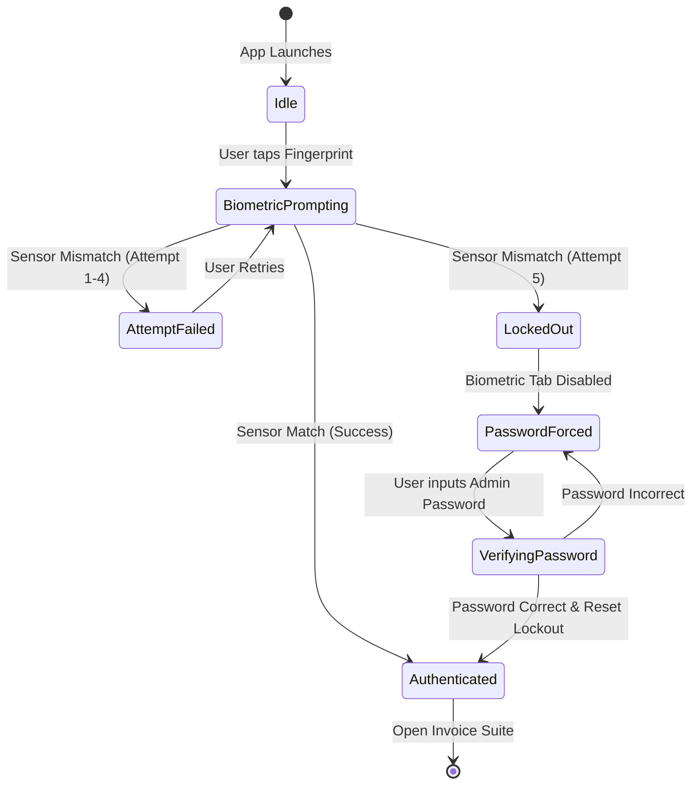

# 🏛️ RoboGyaan Invoice Suite - System Architecture & Security Specification

This architecture document details the dual-mode biometric and cryptographic authentication architecture implemented in **RoboGyaan Invoice Suite v1.5.8** across Web, Android, macOS, and Windows.

---

## 1. High-Level Authentication Architecture

---

## 2. Hardware Sensor Compatibility Matrix

The architecture provides universal hardware abstraction, ensuring fingerprint authentication works on every consumer hardware configuration:

| Platform / Form Factor | Sensor Placement / Mechanism | Underlying Technology | API Integration |
| :--- | :--- | :--- | :--- |
| **Android (Modern Flagship)** | In-display screen (Ultrasonic) | Sound wave acoustic 3D mapping | `androidx.biometric.BiometricPrompt` (`BIOMETRIC_STRONG`) |
| **Android (Mid-Range/AMOLED)** | In-display screen (Optical) | High-resolution optical illumination | `androidx.biometric.BiometricPrompt` (`BIOMETRIC_STRONG`) |
| **Android (Side / Ergonomic)** | Power button (Capacitive) | Semiconductor electrostatic capacitance | `androidx.biometric.BiometricPrompt` (`BIOMETRIC_WEAK / STRONG`) |
| **Android (Classic / Legacy)** | Rear chassis next to camera | Capacitive swipe / touch array | `androidx.biometric.BiometricPrompt` + `USE_FINGERPRINT` |
| **macOS (MacBook Air / Pro)** | Keyboard top-right Touch ID key | Secure Enclave capacitive sensor | WebAuthn `navigator.credentials` (`platform`) |
| **Windows Laptops** | Power button / wrist rest sensor | Windows Hello biometric driver | WebAuthn `navigator.credentials` (`platform`) |
| **iOS (iPhone / iPad)** | Home button / Face ID | Secure Enclave biometrics | WebKit WebAuthn platform authenticator |

---

## 3. Finite State Machine: Biometric Lockout Policy

To prevent unauthorized shoulder-surfing, repeated guessing, or spoofing, the app enforces a strict **5-Attempt Lockout Policy**:

---

## 4. Cryptographic Security Standards

1. **Zero Plaintext Transmission**:
   - Plaintext passwords are never sent over the wire or stored in memory.
   - Client-side derivation uses **Argon2id** (`salt: robogyaan_invoice_auth_salt_2026`, iterations: 3, memory: 4096 KB, parallelism: 1).
2. **Hardware-Backed Key Storage**:
   - On Android: Private biometric credentials and cryptographic materials are bound to the Android Keystore / TEE (Trusted Execution Environment).
   - On Web: WebAuthn private keys are held securely inside the OS Secure Enclave (Apple) or TPM 2.0 / Windows Hello Credential Guard (Microsoft).
3. **Session Persistence**:
   - Web: Secure, HTTP-only, SameSite=Lax cookie (`robogyaan_auth_session`) valid for 30 days.
   - Android: Encrypted persistent authentication preferences in app private sandbox.
