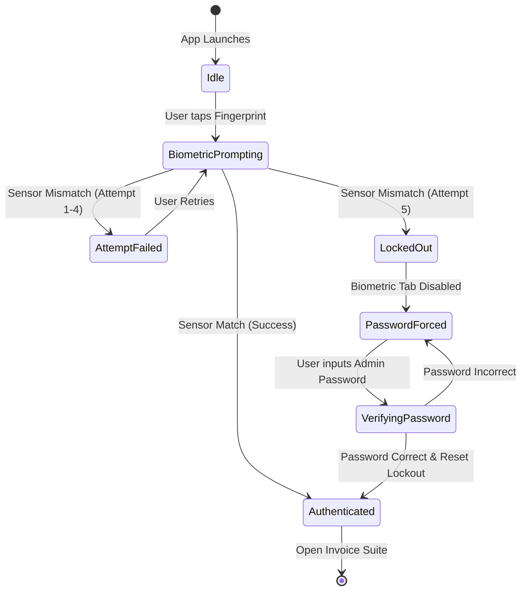
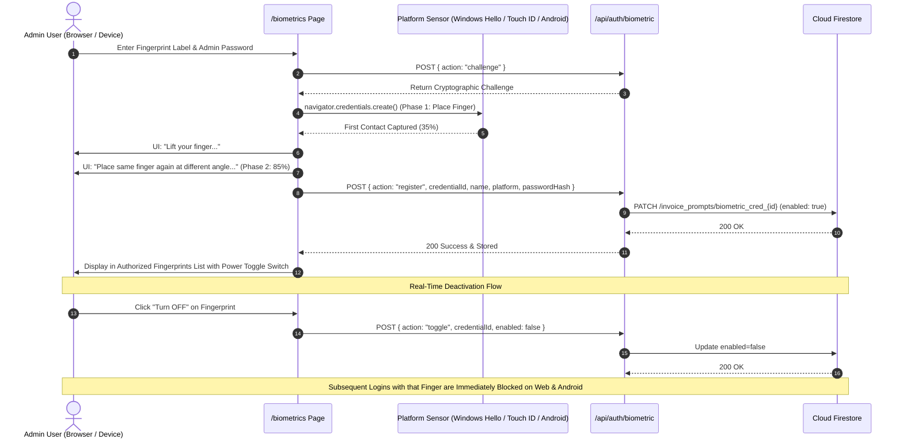
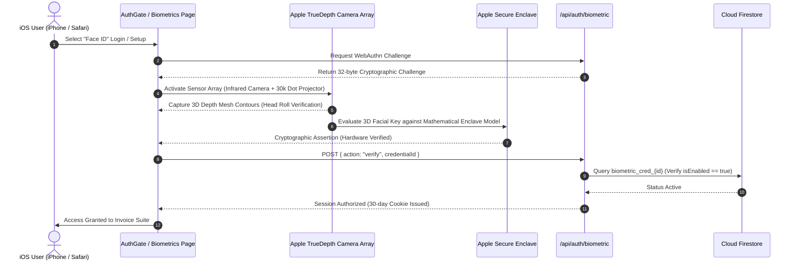

# 🏛️ RoboGyaan Invoice Suite - System Architecture & Security Specification

This architecture document details the dual-mode biometric and cryptographic authentication architecture implemented in **RoboGyaan Invoice Suite v1.5.8** across Web, Android, macOS, and Windows.

---

## 1. High-Level Authentication Architecture

---

## 2. Hardware Sensor Compatibility Matrix

The architecture provides universal hardware abstraction, ensuring fingerprint authentication works on every consumer hardware configuration:

| Platform / Form Factor | Sensor Placement / Mechanism | Underlying Technology | API Integration |
| :--- | :--- | :--- | :--- |
| **Android (Modern Flagship)** | In-display screen (Ultrasonic) | Sound wave acoustic 3D mapping | `androidx.biometric.BiometricPrompt` (`BIOMETRIC_STRONG`) |
| **Android (Mid-Range/AMOLED)** | In-display screen (Optical) | High-resolution optical illumination | `androidx.biometric.BiometricPrompt` (`BIOMETRIC_STRONG`) |
| **Android (Side / Ergonomic)** | Power button (Capacitive) | Semiconductor electrostatic capacitance | `androidx.biometric.BiometricPrompt` (`BIOMETRIC_WEAK / STRONG`) |
| **Android (Classic / Legacy)** | Rear chassis next to camera | Capacitive swipe / touch array | `androidx.biometric.BiometricPrompt` + `USE_FINGERPRINT` |
| **macOS (MacBook Air / Pro)** | Keyboard top-right Touch ID key | Secure Enclave capacitive sensor | WebAuthn `navigator.credentials` (`platform`) |
| **Windows Laptops** | Power button / wrist rest sensor | Windows Hello biometric driver | WebAuthn `navigator.credentials` (`platform`) |
| **iOS (iPhone / iPad)** | Home button / Face ID | Secure Enclave biometrics | WebKit WebAuthn platform authenticator |

---

## 3. Finite State Machine: Biometric Lockout Policy

To prevent unauthorized shoulder-surfing, repeated guessing, or spoofing, the app enforces a strict **5-Attempt Lockout Policy**:

---

## 5. Central Cloud Storage & Browser Enrollment Architecture (`/biometrics`)

---

## 6. Apple Face ID TrueDepth Biometric Architecture (v1.6.0)

When accessed on Apple iOS devices (iPhone, iPad) or Apple Safari browsers, the suite dynamically adapts to dedicated **Apple Face ID** biometric authentication:

### Apple TrueDepth Hardware Subsystem & Security:
1. **Dynamic Island / Sensor Notch Visualizer:** Emulates Apple's infrared camera emitter, speaker bar, and 30,000 IR dot matrix projection.
2. **Circular Head Roll Setup Wizard:** Guides user through two full 3D head rolls with 24 radial green segments that light up as depth contour coverage reaches 100%.
3. **Platform Separation:** Face ID is strictly scoped to Apple devices (iOS and Safari), while Android and Windows devices maintain dedicated fingerprint sensor flows.
4. **5-Attempt Lockout Parity:** Enforces strict lockout upon 5 consecutive failed face recognition attempts with automatic fallback to Admin Password.

