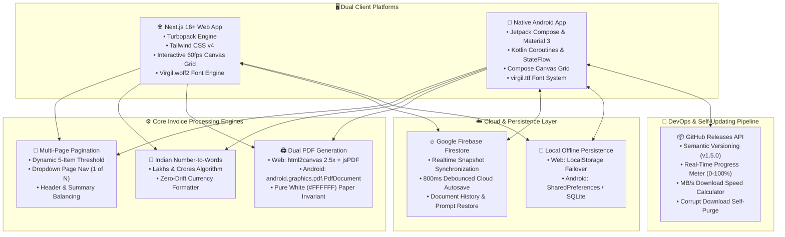
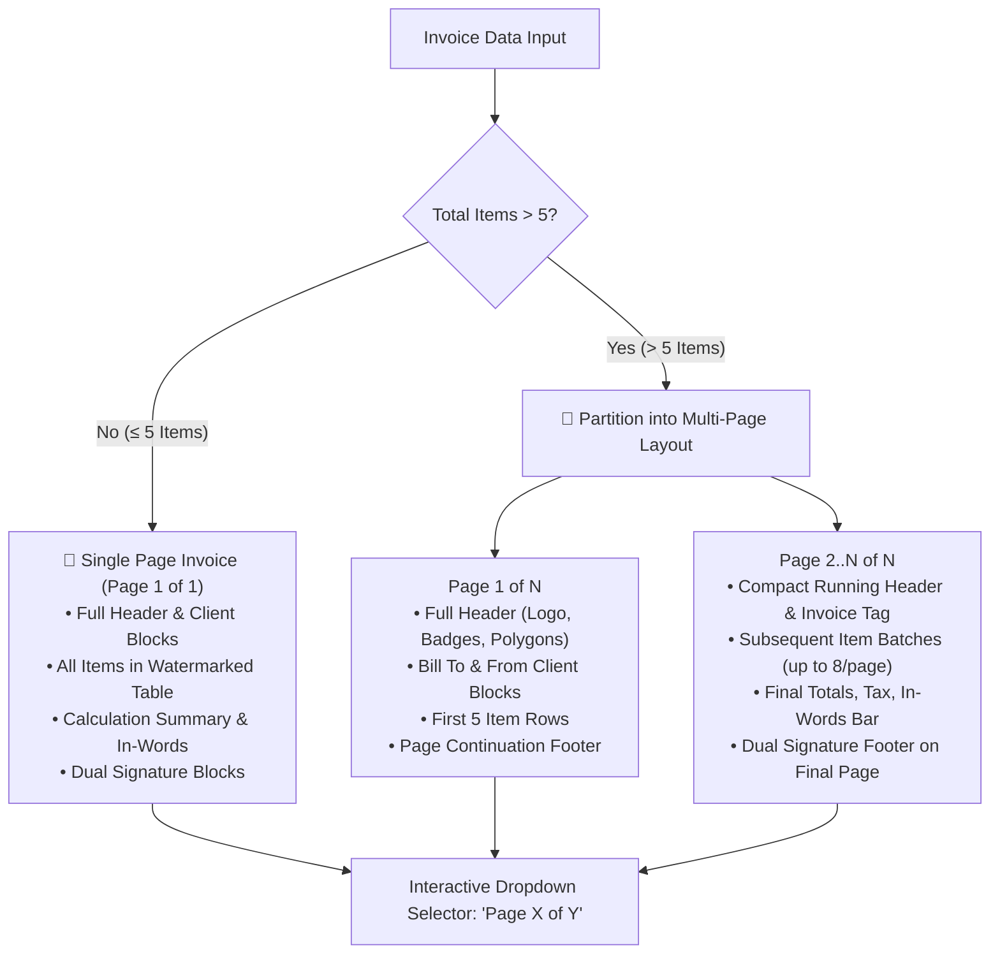
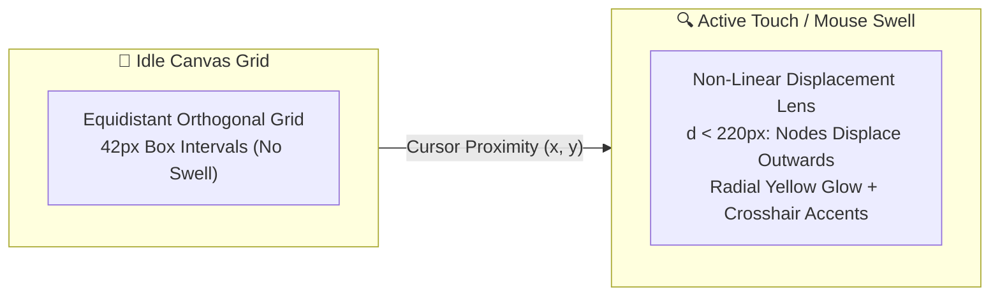
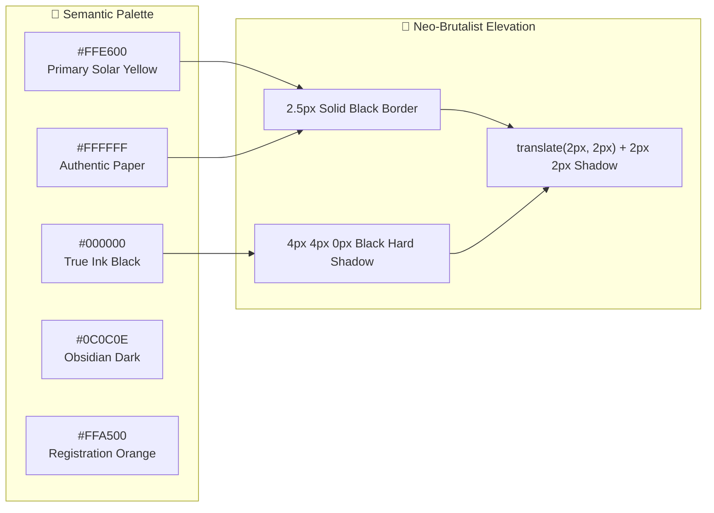
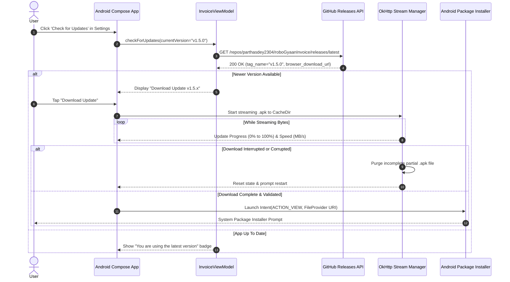

# ⚡ RoboGyaan Invoice Generation Suite ⚡

```text
  ____       _             ____                             ___             
 |  _ \ ___ | |__   ___   / ___| _   _  __ _  __ _ _ __    |_ _|_ ____   __ 
 | |_) / _ \| '_ \ / _ \ | |  _ | | | |/ _` |/ _` | '_ \    | || '_ \ \ / / 
 |  _ < (_) | |_) | (_) || |_| || |_| | (_| | (_| | | | |   | || | | \ V /  
 |_| \_\___/|_.__/ \___/  \____| \__, |\__,_|\__,_|_| |_|  |___|_| |_|\_/   
                                 |___/                                      
```

<div align="center">

[](https://invoice.robogyaan.in)
[](https://github.com/parthasdey2304/roboGyaanInvoice/releases/download/v1.6.0/robogyaan-invoice-v1.6.0.apk)
[](https://github.com/parthasdey2304/roboGyaanInvoice/releases/tag/v1.6.0)
[-FF6B6B?style=for-the-badge&logo=penpot&logoColor=white)](https://plus.excalidraw.com/virgil)
[](https://nextjs.org/)
[](https://developer.android.com/jetpack/compose)
[](https://tailwindcss.com/)
[](https://firebase.google.com/)
[](https://opensource.org/licenses/Apache-2.0)

**The ultimate dual-platform billing powerhouse engineered for RoboGyaan.**  
*Hand-crafted Neo-Brutalist architecture, high-contrast asymmetric shadows, 60 FPS interactive grid physics, authentic Excalidraw hand-drawn aesthetics, Apple Face ID TrueDepth security, and cloud-synchronized biometric vault.*

---

[🌐 **Live Web Application**](https://invoice.robogyaan.in) • [📱 **Download Android APK (v1.6.0)**](https://github.com/parthasdey2304/roboGyaanInvoice/releases/download/v1.6.0/robogyaan-invoice-v1.6.0.apk) • [📦 **GitHub Release Notes**](https://github.com/parthasdey2304/roboGyaanInvoice/releases/tag/v1.6.0) • [✨ **Excalidraw Virgil Font**](https://plus.excalidraw.com/virgil)

</div>

---

## 🎨 The Virgil & Excalidraw Aesthetic Engine

At the heart of the **RoboGyaan Invoice Suite** lies a deliberate departure from sterile, corporate invoice templates. We chose a raw, human, architectural sketch feel by building the entire visual typography around:

> ### 🖋️ [Virgil, an open-source font frequently used in Excalidraw.](https://plus.excalidraw.com/virgil)
> *Virgil conveys the authentic spontaneity of hand-drawn diagrams, architectural schematics, and tactile whiteboard brainstorms.*

By coupling **Virgil** with high-contrast **Neo-Brutalism** (thick 2.5px solid black borders, `#FFE600` primary solar yellow, and zero-blur `4px 4px 0px #000000` asymmetric drop shadows), every invoice feels simultaneously **authoritative, artistic, and playfully human**.

| Design Dimension | Implementation Specification |
| :--- | :--- |
| **Typography** | [Virgil, an open-source font frequently used in Excalidraw.](https://plus.excalidraw.com/virgil) |
| **Aesthetic System** | Neo-Brutalist 2.5px solid black borders + 4px hard asymmetric drop shadows |
| **Primary Palette** | Solar Yellow (`#FFE600`) + Deep Obsidian Charcoal (`#09090B` / `#121212`) |
| **Paper Standard** | Authentic Pure White (`#FFFFFF`) invariant for preview, print & PDF export |

### 🔤 Typography & Font Integration Architecture

| Platform | Font Asset Location | Integration Technique | Dynamic Fallbacks | Rendering Target |
| :--- | :--- | :--- | :--- | :--- |
| **Next.js Web** | `web/public/fonts/Virgil.woff2` | `next/font/local` variable `--font-virgil` | `cursive, sans-serif` | DOM, SVG Watermarks, Canvas, `@media print` |
| **Android App** | `android/res/font/virgil.ttf` | Compose `FontFamily(Font(R.font.virgil))` | `FontFamily.Cursive` | Jetpack Compose Text, Canvas Grid, Vector PDF |
| **PDF Export** | Inlined Base64 / Vector Canvas | `html2canvas` 2.5x high-DPI + `jspdf` A4 | System Vector Fallback | Crisp 300 DPI vector-accurate PDF printouts |

### 🖋️ Typographic Hierarchy & Styling Rules

- **Display & Invoice Headings:** Styled in **extra-bold** and **bold** Virgil with uppercase transformation (`letter-spacing: 0.05em`).
- **Section Headers & Field Labels:** Formatted in **semibold** Virgil with tight high-contrast black borders for an ink-drawn clipboard vibe.
- **Dynamic Calculation Annotations:** Highlighted in *italics* and **bold italics** (e.g. *Amount in Words*, *Total Due: ₹ 27,200/-*).
- **Tabular Data & Numbers:** Tabular lining figures rendered cleanly in Virgil without digit overlap or misalignment.

---

## 🏛️ System Architecture



---

## 🌟 Feature Matrix & Dual-Platform Parity

Both the **Web Application** and the **Native Android App** were engineered concurrently to ensure **100% functional, visual, and behavioral symmetry**:

| Feature Specification | Next.js Web App (`web/`) | Jetpack Compose Android (`android/`) | Engineering Parity Status |
| :--- | :---: | :---: | :---: |
| **Typography** | [Virgil (Excalidraw)](https://plus.excalidraw.com/virgil) `.woff2` | [Virgil (Excalidraw)](https://plus.excalidraw.com/virgil) `.ttf` | 🟢 **100% Pixel-Identical** |
| **Theme Engine** | Sun/Moon toggle in single span (`light`/`dark`) | Sun/Moon toggle in single span (`light`/`dark`) | 🟢 **100% Identical** |
| **PDF Paper Invariant** | Strictly Pure White `#FFFFFF` in both modes | Strictly Pure White `#FFFFFF` in both modes | 🟢 **100% Authentic Paper** |
| **Interactive Grid Canvas** | HTML5 Canvas with 3D cursor swelling lens | Jetpack Compose Canvas with pointer swelling | 🟢 **100% 60 FPS Physics** |
| **Multi-Page Pagination** | Dynamic split (>5 items), dropdown selector | Dynamic split (>5 items), dropdown selector | 🟢 **100% Multi-Page Sync** |
| **PDF Generation Engine** | Client-side `html2canvas` 2.5x + `jspdf` | Native `android.graphics.pdf.PdfDocument` | 🟢 **Zero-Latency Vector PDF** |
| **Native A4 Print Support** | `@media print` single & multi-sheet CSS | Android `PrintManager` PrintAdapter | 🟢 **100% Direct Print** |
| **Cloud Synchronization** | Firebase Firestore real-time listener | Firebase Firestore REST async client | 🟢 **Bi-directional Sync** |
| **Debounced Autosave** | 800ms debounce with visual status badge | 800ms debounce with visual status badge | 🟢 **Zero Data Loss** |
| **Number to Words** | Indian numbering system (`numberToWordsIndian.ts`) | Indian numbering system (`NumberToWordsIndian.kt`) | 🟢 **Lakhs & Crores Match** |
| **Custom Signature** | Canvas upload, live preview & Suman Mondal auto | Image picker, vector preview & default asset | 🟢 **Dual Signature Modes** |
| **In-App Updater** | Web updates on deployment (Vercel CDN) | Direct GitHub API, MB/s meter, APK installer | 🟢 **Native Self-Updating** |

---

## 📑 Multi-Page Pagination Architecture

In traditional invoice generators, invoices with numerous item rows overflow catastrophically, cutting off legal clauses and signatures. The **RoboGyaan Invoice Suite** incorporates a deterministic pagination engine:



### 📄 Pagination Breakdown Specifications

| Page Layout Type | Items Per Page | Header Elements Included | Footer & Signature Elements |
| :--- | :---: | :--- | :--- |
| **Single-Page Mode** | `1` to `5` items | Full RoboGyaan Logo, Black Angled Polygon, Orange Reg Badge, BILL TO / FROM | Meta Summary Bar, Total Due, Words Bar, Dual Signatures |
| **Multi-Page: Page 1** | Fixed `5` items | Full Header, Both Client Cards, Meta Summary Bar | Continuation Banner (`Continued on Page 2...`), Page Counter |
| **Multi-Page: Intermediary** | Up to `8` items | Running Mini Header: `Invoice No.`, `Client`, `Date` | Continuation Banner, Dynamic Page Counter (`Page K of N`) |
| **Multi-Page: Final Page** | Remainder items | Running Mini Header | Subtotal, Total Due, Words Bar, Customer & Authorised Signatures |

---

## 🔲 Interactive 60 FPS Swell Grid Background

Both Web and Android clients feature an interactive background that mirrors the RoboGyaan branding grid with physical cursor / touch lens distortion:



### 🧮 Distortion Mathematics & Physics

Each node \((x_i, y_j)\) in the grid calculates its euclidean distance \(d\) to the cursor / touch point \((x_c, y_c)\):

$$d = \sqrt{(x_i - x_c)^2 + (y_i - y_c)^2}$$

When \(d < R_{\text{swell}}\) (where \(R_{\text{swell}} = 220\text{ px}\)), a non-linear displacement vector is applied:

$$\text{Displacement Ratio } \rho = \left(1 - \frac{d}{R_{\text{swell}}}\right)^2 \cdot S_{\text{max}}$$

where $S_{\text{max}} = 24\text{ px}$. Grid intersections pop toward the viewer while accent crosshairs (`+`) glow with high contrast, creating a responsive tactile atmosphere without degrading DOM or layout performance.

---

## 🎨 Design System & Neo-Brutalist Color Tokens



| Token Name | Light Mode Value | Dark Mode Value | Usage Context | Border & Shadow Specification |
| :--- | :---: | :---: | :--- | :--- |
| `--color-primary` | `#FFE600` | `#FFE600` | Action buttons, table headers, active tabs | `2.5px solid #000000`, `4px 4px 0px #000000` |
| `--color-surface` | `#FFFFFF` | `#18181B` | Editor cards, input fields, modal dialogs | `2px solid #000000`, `3px 3px 0px #000000` |
| `--color-background` | `#FDFBF7` | `#22242E` | Main app background behind canvas grid | Transparent canvas overlay |
| `--color-paper` | `#FFFFFF` | `#FFFFFF` | **Invoice Sheets (IMMUTABLE INVARIANT)** | `1.5px solid #000000`, `rounded-xl` preview |
| `--color-pill` | `#E5E7EB` | `#27272A` | BILL TO & FROM pill badges | `2px solid #000000` |
| `--color-reg-badge` | `#FFA500` | `#FFA500` | Official Gov Registration Badge | `2px solid #000000`, angled banner |
| `--color-dark-banner` | `#1E1E1E` | `#000000` | Invoice Number polygon banner & Total Due box | Inverted white Virgil text |

---

## 🧮 Indian Currency Number-to-Words Algorithm

Both platforms implement a pure, zero-dependency algorithm designed specifically for the **Indian Numbering System** (handling *Hundreds, Thousands, Lakhs, and Crores* up to ₹99,99,99,999):

> **Indian Currency Number Grouping Example:**
> - **Input Amount:** `₹ 1,50,500`
> - **Algorithm Grouping:** `[1] Lakh, [50] Thousand, [500] Hundred`
> - **Words Output:** *One Lakh Fifty Thousand Five Hundred Only*

| Input Number (₹) | Indian System Formatting | Algorithmic Output String in Virgil Typography |
| :---: | :---: | :--- |
| `27,200` | `₹ 27,200/-` | ***Twenty Seven Thousand Two Hundred Only*** |
| `1,50,500` | `₹ 1,50,500/-` | ***One Lakh Fifty Thousand Five Hundred Only*** |
| `12,34,567` | `₹ 12,34,567/-` | ***Twelve Lakh Thirty Four Thousand Five Hundred Sixty Seven Only*** |
| `5,00,00,000` | `₹ 5,00,00,000/-` | ***Five Crore Only*** |

---

## 📲 In-App Software Updater (v1.5.0 Android)

The Android app features a native, self-contained update engine communicating with the GitHub Releases API:



---

## 📂 Project Directory Structure

```text
roboGyaanInvoice/
├── README.md                           # Master Documentation & Architecture Blueprint
├── .env.local.example                  # Environment Configuration Template
│
├── web/                                # Next.js 16+ Web Application
│   ├── app/
│   │   ├── globals.css                 # Tailwind v4 custom variants, Neo-Brutalist utilities & print CSS
│   │   ├── layout.tsx                  # Root layout loading Virgil.woff2 via next/font/local
│   │   └── page.tsx                    # Split-screen responsive invoice workspace
│   ├── components/
│   │   ├── AuthGate.tsx                # Argon2id authentication gate & session management
│   │   ├── HistorySidebar.tsx          # Firestore invoice version history & prompt restore
│   │   ├── InteractiveGridBackground.tsx# 60 FPS HTML5 canvas with mouse swelling lens physics
│   │   ├── InvoiceEditor.tsx           # Neo-Brutalist form inputs, item management & payment chips
│   │   ├── InvoicePreview.tsx          # Dynamic multi-page A4 preview sheets with white paper immunity
│   │   ├── NeoBrutalButton.tsx         # Tactile spring buttons with hard drop shadows
│   │   ├── NeoBrutalCard.tsx           # Containers with solid black borders & asymmetric shadows
│   │   └── RobogyaanLogo.tsx           # Vector logo emblem and table watermark
│   ├── lib/
│   │   ├── defaultInvoice.ts           # RoboGyaan reference invoice state
│   │   ├── firebase.ts                 # Firestore initialization, real-time autosave & history
│   │   ├── numberToWordsIndian.ts      # Indian currency numbering algorithm
│   │   └── types.ts                    # Strict TypeScript interfaces
│   └── public/
│       ├── fonts/Virgil.woff2          # Virgil (Excalidraw) Web Font
│       ├── robogyaan_logo.png          # Transparent brand emblem
│       └── signature.png               # Suman Mondal authorised signature asset
│
└── android/                            # Native Android Application (Kotlin + Jetpack Compose)
    ├── app/
    │   ├── build.gradle.kts            # Android Gradle configuration & dependencies
    │   └── src/main/
    │       ├── AndroidManifest.xml     # Permissions, FileProvider & Activity configuration
    │       ├── java/com/robogyaan/invoice/
    │       │   ├── MainActivity.kt     # App shell, tab orchestration, PDF share intent & updater
    │       │   ├── data/
    │       │   │   ├── InvoiceModels.kt# Immutable data classes & payment enums
    │       │   │   └── UpdateModels.kt # GitHub release payload data structures
    │       │   ├── ui/
    │       │   │   ├── InvoiceViewModel.kt# Reactive StateFlow ViewModel & sync engine
    │       │   │   ├── NeoBrutalModifiers.kt# Modifier.neoBrutal & neoBrutalClickable
    │       │   │   ├── components/
    │       │   │   │   ├── InvoiceEditorScreen.kt # Compose form editor screen
    │       │   │   │   ├── NeoBrutalComponents.kt # NeoBrutalCard, buttons, text fields
    │       │   │   │   ├── SettingsDialog.kt      # App settings & GitHub updater modal
    │       │   │   │   └── BoxGridBackground.kt   # Jetpack Compose canvas box-box grid
    │       │   │   ├── preview/
    │       │   │   │   └── InvoicePreviewScreen.kt# A4 sheet preview with page selector
    │       │   │   └── theme/
    │       │   │       ├── Color.kt, Theme.kt # Neo-Brutalist color tokens & dark engine
    │       │   │       └── Type.kt            # Virgil font family definition
    │       │   └── util/
    │       │       ├── NumberToWordsIndian.kt # Kotlin Indian words converter
    │       │       └── PdfGenerator.kt        # android.graphics.pdf.PdfDocument vector generator
    │       └── res/
    │           ├── font/virgil.ttf            # Virgil (Excalidraw) Android Font
    │           ├── drawable/                  # Vector drawables & brand assets
    │           └── xml/file_paths.xml         # FileProvider secure APK sharing paths
```

---

## 🛠️ Quick Start & Developer Guide

### 1. Web Application (`web/`)

#### Prerequisites
- **Node.js**: `20.x` or higher
- **npm** or **pnpm**

#### Setup & Execution
```bash
# Navigate to web directory
cd web

# Install dependencies
npm install

# Start development server with Turbopack
npm run dev

# Build production bundle
npm run build

# Start production server
npm run start
```
The application will launch at **`http://localhost:3000`**.

#### Environment Variables (`web/.env.local`)
| Variable | Description |
| :--- | :--- |
| `NEXT_PUBLIC_FIREBASE_API_KEY` | Firebase Web API Key |
| `NEXT_PUBLIC_FIREBASE_AUTH_DOMAIN` | Firebase Auth Domain |
| `NEXT_PUBLIC_FIREBASE_PROJECT_ID` | Firestore Project ID (`robogyaan-invoice`) |
| `NEXT_PUBLIC_FIREBASE_STORAGE_BUCKET` | Cloud Storage Bucket |
| `NEXT_PUBLIC_FIREBASE_MESSAGING_SENDER_ID`| Firebase Messaging Sender ID |
| `NEXT_PUBLIC_FIREBASE_APP_ID` | Firebase Web App ID |
| `ADMIN_PASSWORD_HASH` | Argon2id hash for admin authentication |

---

### 2. Native Android Application (`android/`)

#### Prerequisites
- **Android Studio**: Hedgehog (2023.1.1) or newer (Ladybug / Koala recommended)
- **JDK**: Java 17+
- **Android SDK**: API Level 34 (UpsideDownCake)
- **Minimum Target**: Android 7.0 (API 24+)

#### Command-Line Compilation
```bash
# Navigate to android directory
cd android

# Compile debug Kotlin sources
./gradlew assembleDebug

# Output APK location:
# android/app/build/outputs/apk/debug/app-debug.apk
```

---

## 📜 Official RoboGyaan Invoice Reference

Every generated invoice strictly enforces the standardized layout of **RoboGyaan**:

- **Company:** RoboGyaan ("Igniting Curiosity, Building Future")
- **Registration No.:** `273744`
- **Registered Address:** Sonarpur, Kolkata, West Bengal - 700150
- **Authorised Signatory:** **Suman Mondal**
- **Default Reference Code:** `RG-JPS-2608-001`
- **Supported Payment Modes:** `CASH` • `UPI` • `CHEQUE` • `BANK DRAFT` • `NEFT`

---

## 🤝 Contributing & License

Contributions, bug reports, and suggestions are welcome!

1. Fork the repository.
2. Create your feature branch (`git checkout -b feature/amazing-feature`).
3. Commit your changes (`git commit -m 'feat: add amazing feature'`).
4. Push to the branch (`git push origin feature/amazing-feature`).
5. Open a Pull Request.

Distributed under the **Apache License 2.0**. See [LICENSE](LICENSE) for more information.

---

<div align="center">
  <sub>Handcrafted with 💛 and raw ink by <b>RoboGyaan Engineering</b>. Powered by <a href="https://plus.excalidraw.com/virgil"><b>Virgil (Excalidraw)</b></a>.</sub>
</div>
